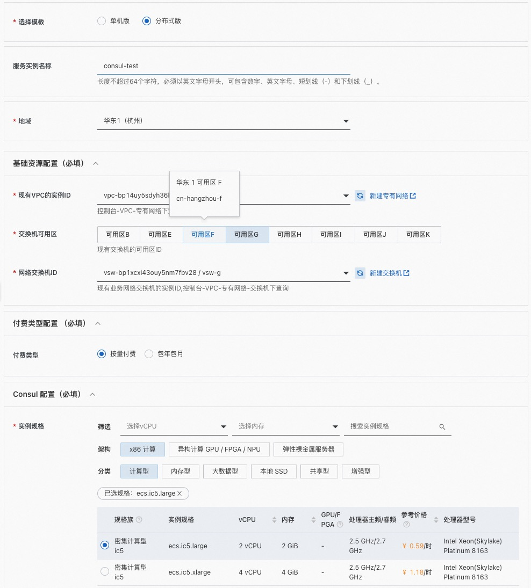
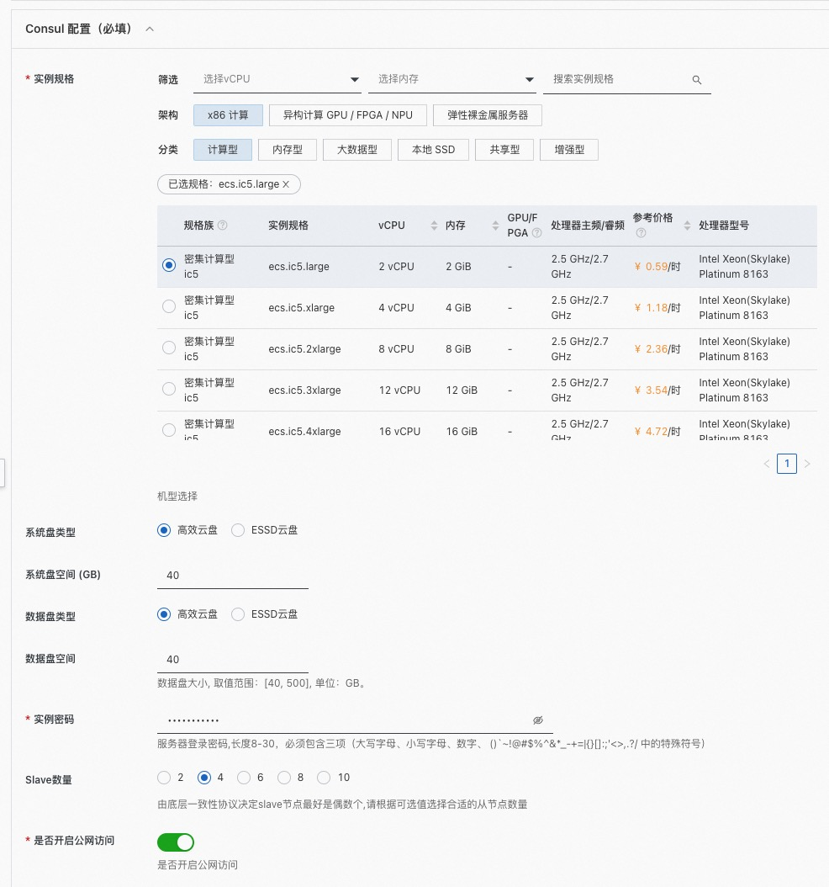
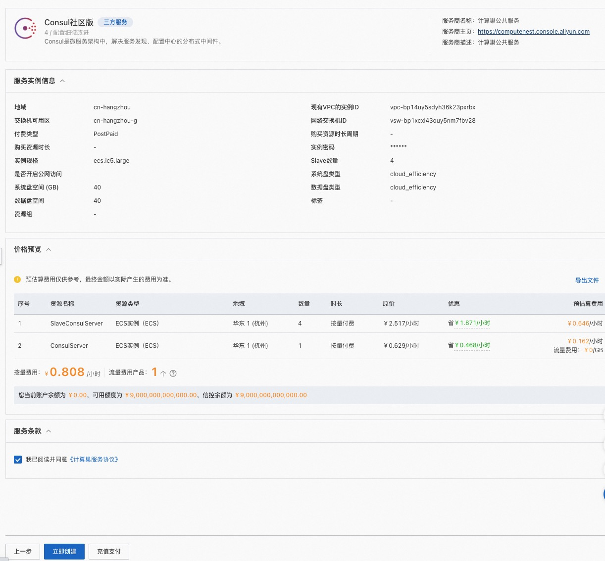
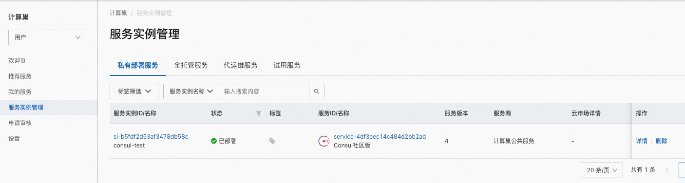
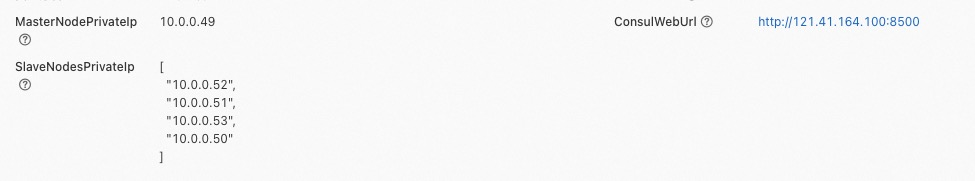
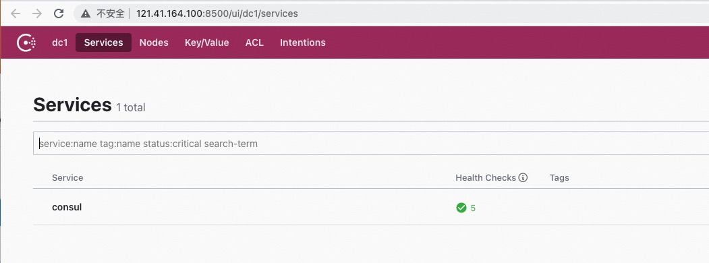

# Consul社区版服务实例部署文档
## 概述
Consul 是 HashiCorp 公司推出的开源工具，用于实现分布式系统的服务发现与配置。与其他分布式服务注册与发现的方案，Consul 的方案更“一站式”，内置了服务注册与发现框 架、分布一致性协议实现、健康检查、Key/Value 存储、多数据中心方案，不再需要依赖其他工具（比如ZooKeeper等）。使用起来也较 为简单。Consul 使用 Go 语言编写，因此具有天然可移植性(支持Linux、windows和Mac OS X)；安装包仅包含一个可执行文件，方便部署，与 Docker 等轻量级容器可无缝配合。
## 计费说明
Consul社区版在计算巢上的费用主要涉及：

- 所选vCPU与内存规格
- 磁盘容量
- 公网带宽

计费方式包括：

- 按量付费（小时）
- 包年包月

预估费用在创建实例时可实时看到。
## 
## 部署架构
Consul社区版有单机部署和分布式部署(一主多从)两种架构。

## RAM账号所需权限
Consul服务需要对ECS、VPC等资源进行访问和创建操作，若您使用RAM用户创建服务实例，需要在创建服务实例前，对使用的RAM用户的账号添加相应资源的权限。添加RAM权限的详细操作，请参见[为RAM用户授权](https://help.aliyun.com/document_detail/121945.html)。所需权限如下表所示。

| 权限策略名称 | 备注 |
| --- | --- |
| AliyunECSFullAccess | 管理云服务器服务（ECS）的权限 |
| AliyunVPCFullAccess | 管理专有网络（VPC）的权限 |
| AliyunROSFullAccess | 管理资源编排服务（ROS）的权限 |
| AliyunComputeNestUserFullAccess | 管理计算巢服务（ComputeNest）的用户侧权限 |
| AliyunCloudMonitorFullAccess | 管理云监控（CloudMonitor）的权限 |

## 部署流程
### 部署步骤
单击[部署链接](https://computenest.console.aliyun.com/user/cn-hangzhou/serviceInstanceCreate?ServiceId=service-4df3eec14c484d2bb2ad)，进入服务实例部署界面，根据界面提示，填写参数完成部署。

### 
### 部署参数说明
您在创建服务实例的过程中，需要配置服务实例信息。下文介绍Consul社区版服务实例输入参数的详细信息。

| 参数组        | 参数项    | 示例           | 说明                        |
|------------|--------|--------------| --- |
| 选择模板       |        | 分布式版         | 模板架构类型                     |
| 服务实例名称     |        | test         | 实例的名称                     |
| 地域         |        | 华东1（杭州）      | 选中服务实例的地域，建议就近选中，以获取更好的网络延时。 |
| 基础资源配置（必填） | 现有VPC的实例ID | vpc-xxx      | 选择专有网络的ID。                |
| 基础资源配置（必填） | 交换机可用区 | 可用区I      | 地域下的不同可用区域 。                |
| 基础资源配置（必填） | 网络交换机ID | vsw-xxx      | 地域下的不同可用区域 。                |
| 可用区配置      | 部署区域   | 可用区I         | 选择交换机ID。若找不到交换机, 可尝试切换地域和可用区                |
| 付费类型配置 （必填）     | 付费类型   | 按量付费 或 包年包月  |
| Consul 配置（必填）    | 实例规格   | ecs.g7.large | 实例规格，可以根据实际需求选择           |
| Consul 配置（必填）    | 系统盘类型  | 高效云盘           | 系统盘类型，可以根据实际需求选择          |
| Consul 配置（必填）    | 系统盘空间 (GB)  | 40           | 系统盘空间，可以根据实际需求选择          |
| Consul 配置（必填）    | 数据盘类型  | 高效云盘           | 系统盘类型，可以根据实际需求选择          |
| Consul 配置（必填）    | 数据盘空间 (GB)  | 40           | 系统盘空间，可以根据实际需求选择          |
| Consul 配置（必填）    | 实例密码   | ********     | 设置实例密码。长度8~30个字符，必须包含三项（大写字母、小写字母、数字、()`~!@#$%^&*-+={}[]:;'<>,.?/ 中的特殊符号） |
| Consul 配置（必填）    |  Slave数量  | 2           | consul分布式服务从节点数量          |
| Consul 配置（必填）    | 是否开启公网访问 | true         | 是否开启公网IP                  |

### 
### 创建服务实例

### 
### 参数和费用确认

### 
### 验证结果

1. 查看服务实例。
服务实例创建成功后，部署时间大约需要2分钟。部署完成后，页面上可以看到对应的服务实例。 

2. 通过服务实例访问ZooKeeper
进入到对应的服务实例后，可以在页面上获取到主节点(MasterNodePrivateIp)，从节点(SlaveNodesPrivateIp)，服务端口(ServicePort)，公私网访问的地址(ConsulWebUrl)

3. 公网访问部署好的consul服务
    如果开启了公网访问，可以通过公私网访问的地址(ConsulWebUrl)直接在浏览器访问，没有开启则需要在阿里云上私网访问

### 使用Consul
请访问Consul官网了解如何使用Consul：[Consul使用文档](https://www.consul.io/)
